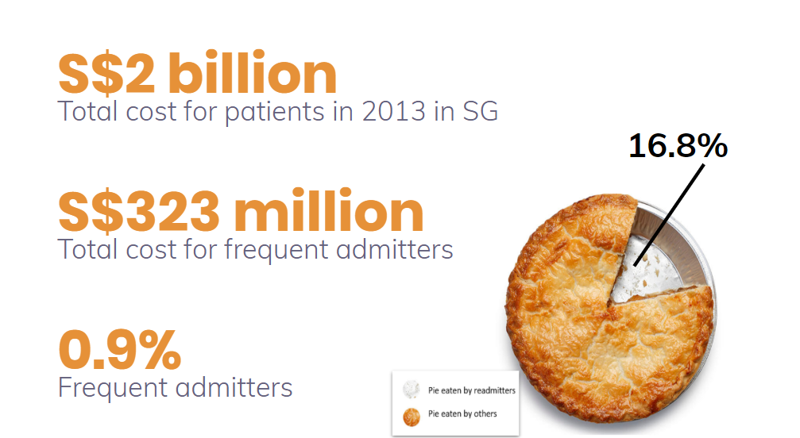
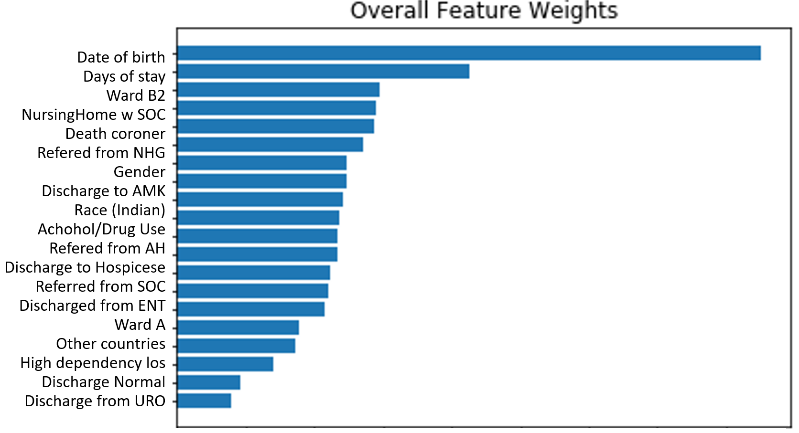
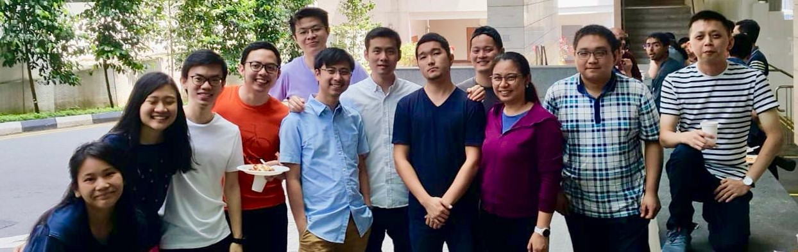

# Prediction of Emergency Room (ER) Readmissions for incoming patients
Machine Learning classification for Healthcare optimization. In collaboration with [National University Hospital](https://www.nuh.com.sg/Pages/Home.aspx), Singapore.

## Problem

Hospital readmissions place a huge strain and cost on current healthcare systems. If clinicians are able to have a sensing on the probability that a patient readmits into ER, they will be able to take steps to mitigate this billion dollar healthcare problem.

Traditional, explainable machine learning models are used in this patient classification prboblem.

## Brief Workflow
1. Data preperation and cleaning for use
2. Feature extraction via expert opinion coupled
3. Chi2 univariate feature selection and optimisation for model cross validation accuracy
3. Passing selected features through the following models:
    - Logistic Regression
    - Decision Tree
    - Random Forest
    - Bootstrap Aggregating
    - AdaBoost
    - KNN
    - Naives Bayes
4. Ensemble via the following methods:
    - Soft voting
    - Stacking of models
    - Weighted sum
6. Model evaluations and further optimisations

## Brief Research Outcomes
- Achieved close to 20% better prediction accuracy than current industry standards (LACE scoring approach).
- Identification of important patient characteristics clinicians can look into to decrease the probability of a readmission of a patient into ER.

## Dataset Used
- National University Health System [Synthetic patient dataset](http://htmlpreview.github.io/?https://github.com/nus-mornin-lab/datathon-gcp-2019/blob/master/bigquery_tutorial/schemas/datadict.html)

## View project:
- [Slide Deck](https://docs.google.com/presentation/d/1iyc6C6Lsc666NSdZDXdKFiKf_86ZJLiCEtb1ZHteHBE/edit?usp=sharing)
- [Code for Final Models](https://github.com/terenceneo/Prediction-of-ER-Readmissions/blob/master/Models.ipynb)

## The Team

### Medical Practitionals
- Chan jun yang
### Data Scientists
- [Terence Neo](https://github.com/terenceneo)
- [Eloise Lim](https://github.com/elmoose)
- Jinyang
- Abdul Sharopov
- Janson Hendryli
- Grace Tarani Sridevi Lee
- Liu Zhuo
- Yeo Zhen Yuan
- Tern Poh
- Shirlene Liew
- John Ang

## Acknowledgements
### Organizing Partners
- [NUS Saw Swee Hock School of Public Health](https://sph.nus.edu.sg/)
- [National University Health System (NUHS)](https://www.nuhs.edu.sg/Pages/Home.aspx)
- MSD
- [MIT Critical Data Lab](https://criticaldata.mit.edu/)

### Technology Partners
- Google Cloud
- National Supercomputing Centre
